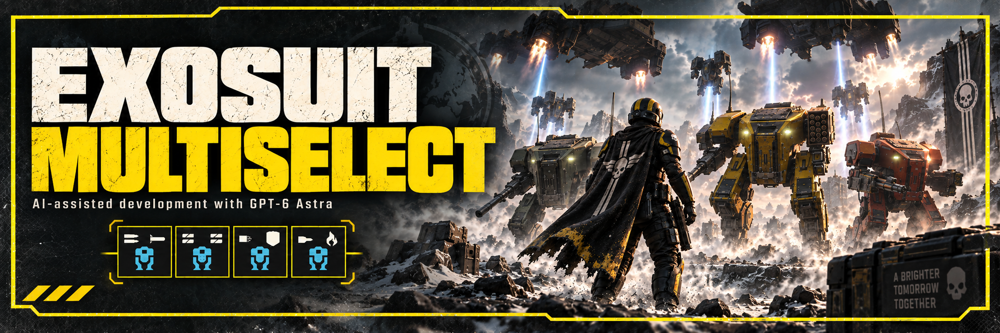

# Exosuit MultiSelect

By [Toritte](https://github.com/Toritte). Select up to four different exosuits in Helldivers 2's standard four stratagem slots.

## Installation
Requires **Bingus Shared Loader v15 / API 1**, installed separately. Download it from [CowboyBingus on AyakaMods](https://ayakamods.com/mods/bingus-shared-loader.3861/) and consult the [official loader instructions](https://github.com/CowboyBingus/BingusSharedLoader).
The loader is not bundled or redistributed with this mod, as requested by its author.

1. Close the game. Download the mod ZIP from [Releases](https://github.com/Toritte/ExosuitMultiSelect/releases) once published.
2. Import the loader ZIP and `Exosuit-MultiSelect-v0.2.zip` into Arsenal or HD2MM; enable both and deploy.
3. Follow the loader's priority instructions. In Arsenal's default priority, put the loader last; with reversed priority put it first.
4. Start the game and select your exosuits. Disable the withdrawn v0.1 and diagnostic observer.

To uninstall, close the game, disable this mod, redeploy and restart. Keep the loader if another installed mod needs it. Details: [INSTALL.txt](INSTALL.txt).

## Compatibility and validation
Tested runtime: Steam build **24826606**, EXE **1.8.45317.0**. Four different exosuits were selected, deployed and reported working by the tester on September 20, 2026. The release packaging retains that exact gameplay payload. The new package's manager import has not yet been tested.

This changes a shared exosuit classification flag, not only the selection interface. Future builds, multiplayer, extended sessions and every other mod combination are not validated. No general anti-cheat compatibility guarantee is established by this test. See [validation](docs/VALIDATION.md).

[Build from source](CONTRIBUTING.md) · [Technical walkthrough](docs/TECHNICAL.md) · [Third-party dependencies](THIRD_PARTY.md) · [Release notes](docs/RELEASE_NOTES.md) · [Artwork](assets/ARTWORK.md)

## Credits and availability
Thanks to CowboyBingus for Bingus Shared Loader and the Windows adapter used by this mod. Read [third-party notices](THIRD_PARTY.md) and [license status](LICENSE-STATUS.md) before redistribution; a project-wide open-source license has not been selected.

The mod is intended to be free. Optional support: [Toritte on Patreon](https://www.patreon.com/cw/Toritte).

AI disclosure: GPT-6 Astra assisted with research, implementation, debugging and documentation.
